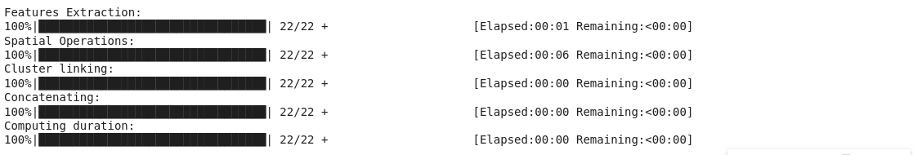
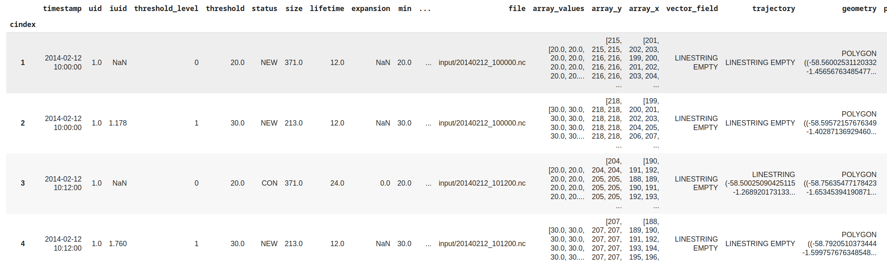
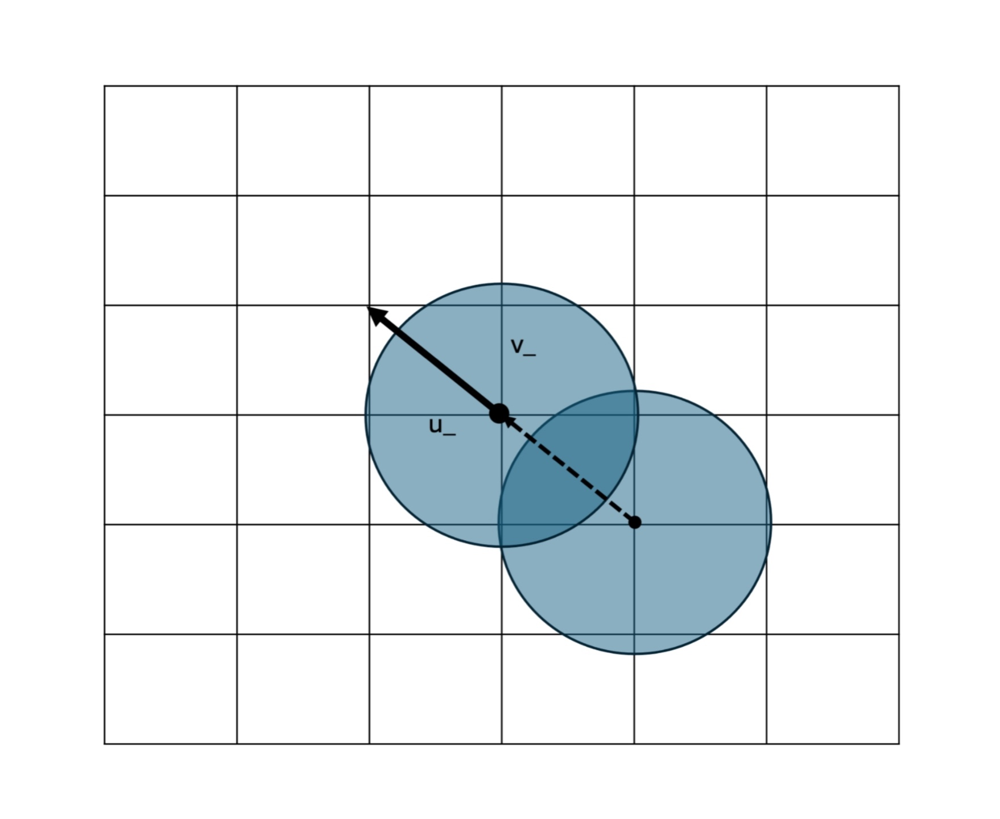

Tracking
=======================================================

Tracking Routine
--------------------------------------------------------

The tracking module represents the core of the pyForTraCC algorithm, responsible for identifying and tracking clusters in time-varying two-dimensional data fields. The entire tracking routine is based on parameters configured in the name_list as described in `NAME_LIST <https://pyfortracc.readthedocs.io/en/latest/BI/BI_NAMELIST.html>`_, and all tracking outputs are generated according to user configurations. This module utilizes tracking parameters and a custom data reading function, enabling adaptation to various input data types. The output of this process is stored as a series of Parquet files in the `trackingtable` directory, forming the complete tracking table.

The tracking process comprises four primary modules:

1. **Feature Extraction**: Identifies clusters in the data through multi-threshold segmentation, contiguous pixel grouping, and statistical characterization of clusters. Supports different clustering methods including NDImage and DBSCAN.

2. **Spatial Operations**: Establishes spatial relationships between clusters in consecutive timesteps, calculates displacement vectors, and determines events such as continuity, splitting, merging, or new clusters.

3. **Cluster Linking**: Connects clusters across time through unique identifiers, records their complete trajectories, and calculates temporal properties such as lifetime.

4. **Concatenation**: Combines all tracking data into a single consolidated structure for subsequent analysis.

Here is the Python code for tracking:

.. code-block:: python

    pyfortracc.track(name_list, read_function)

Tracking Table
--------------------------------------------------------

The tracking table serves as the primary output of the algorithm, containing detailed information about each identified cluster over time. It consists of a collection of Parquet files located in the output directory (output_path + `/track/trackingtable`). The information is stored in a tabular format organized chronologically, providing comprehensive data about clusters at each threshold level.

Here is an example of how to read the tracking table using Pandas:

.. code-block:: python

  import pandas as pd
  import glob

  tracking_files = sorted(glob.glob(name_list['output_path'] + '/track/trackingtable/*.parquet'))
  tracking_table = pd.concat(pd.read_parquet(f) for f in tracking_files)
  tracking_table.head()

**Tracking Table Columns:**

- `cindex` (int[64]): Index that counts the number of lines for all .parquet files.
- `timestamp` (datetime64[us]): Temporal information of the cluster.
- `uid` (float64): Global unique identifier of the cluster.
- `iuid` (float64): Internal unique identifier used for cluster relationships.
- `threshold_level` (int64): Index of the threshold level in the thresholds list.
- `threshold` (float64): Numerical value of the threshold.
- `status` (object): Status of the cluster (NEW, CON, SPL, MRG, MRG/SPL).

  * NEW: New cluster with no predecessors
  * CON: Continuation of a cluster from previous timestep
  * SPL: Cluster resulting from a split
  * MRG: Cluster resulting from a merge
  * MRG/SPL: Cluster involved in both merge and split simultaneously
- `u_`, `v_` (float64): Displacement vector components of the cluster.
- `inside_clusters` (object): Identifiers of clusters contained within this cluster.
- `inside_idx` (object): Indices of clusters contained within this cluster.
- `size` (int64): Cluster size in number of pixels.
- `min`, `mean`, `max`, `std` (float64): Descriptive statistics of values within the cluster.
- `delta_time` (timedelta64[us]): Temporal difference between consecutive frames.
- `file` (object): Name of the associated data file.
- `array_y`, `array_x` (object): Coordinate arrays of pixels comprising the cluster.
- `vector_field` (object): Associated vector field used for motion corrections.
- `trajectory` (object): Representation of the cluster's trajectory as a LineString object.
- `geometry` (object): Geometric representation of the cluster's boundary (Polygon).
- `lifetime` (int64): Accumulated lifetime of the cluster in minutes.
- `expansion` (float64): Normalized expansion rate of the cluster’s area (in 10⁻⁶ s⁻¹). Calculated using the average area between two consecutive timesteps and the difference in size over time. This metric helps quantify the growth or shrinkage of clusters (e.g. the divergence/convergence of clouds for infrared satellite tracking).

.. note::

  The `u_`, `v_` components represent the displacement vector components originating from the centroid of the cluster (central point), as illustrated in the figure below. These components indicate the direction and magnitude of the cluster's movement. It is important to note that the angular direction of these components is determined by the movement direction of the cluster, and their units depend on the namelist configuration. 

  If the `lat_min`, `lat_max`, `lon_min`, and `lon_max` keys are present in the namelist, the units will correspond to the spatiotemporal dimensions of the data. For instance, if the pixel dimensions are in degrees and the temporal resolution is in minutes, the components will be expressed in degrees per minute. Users should ensure that the configuration aligns with their data's spatial and temporal resolution to interpret the results accurately.

Due to the nature of the overlap-centroid-based tracking approach employed in pyForTraCC, vector component extraction can be compromised by cluster deformities. This is a typical issue when dealing with non-rigid objects, such as meteorological phenomena, where shape changes between consecutive timesteps can lead to inaccurate displacement vectors. To address this challenge, the algorithm implements various vector correction methods:

- **Split/merge correction**: Adjusts vectors when clusters undergo splitting or merging events.
- **Inner core correction**: Uses internal structures of clusters for more stable tracking.
- **Optical flow correction**: Applies computer vision techniques (Lucas-Kanade and Farneback methods) to estimate motion fields.
- **Ellipse fitting correction**: Approximates clusters with ellipses to normalize shape changes during tracking.

For each correction method, new columns are created in the tracking table to store the corrected displacement vector components. These columns are named as follows:

- `u_spl`, `v_spl`: Corrected displacement components for split events.
- `u_mrg`, `v_mrg`: Corrected displacement components for merge events.
- `u_inc`, `v_inc`: Corrected displacement components for inner core corrections.
- `u_opt`, `v_opt`: Corrected displacement components for optical flow corrections.
- `u_elp`, `v_elp`: Corrected displacement components for ellipse fitting corrections.

These correction methods significantly attenuate errors in displacement vector composition, improving trajectory accuracy and overall tracking performance. For more detailed information about vector correction methods, please refer to the dedicated documentation in `CORRECTION <https://pyfortracc.readthedocs.io/en/latest/CF/CORRECTION.html>`_ and the published article: `https://doi.org/10.3390/rs14215408 <https://doi.org/10.3390/rs14215408>`_.

For more information and detailed examples, please refer to the examples section.
