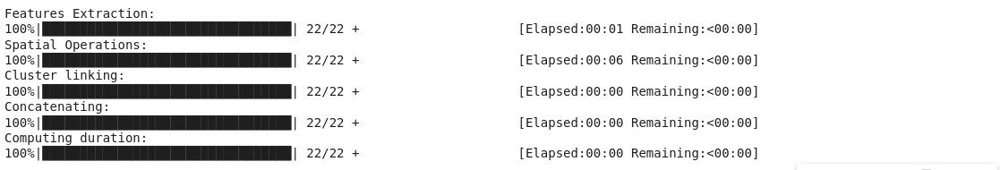
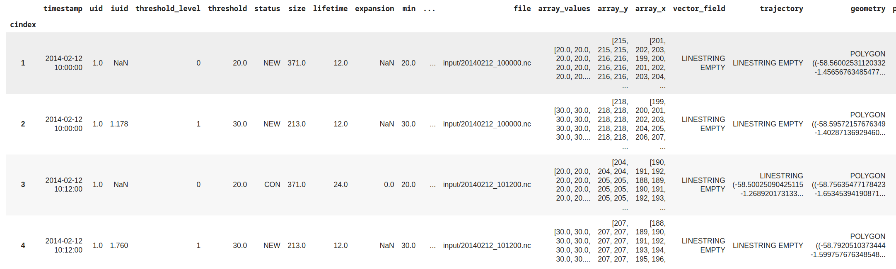
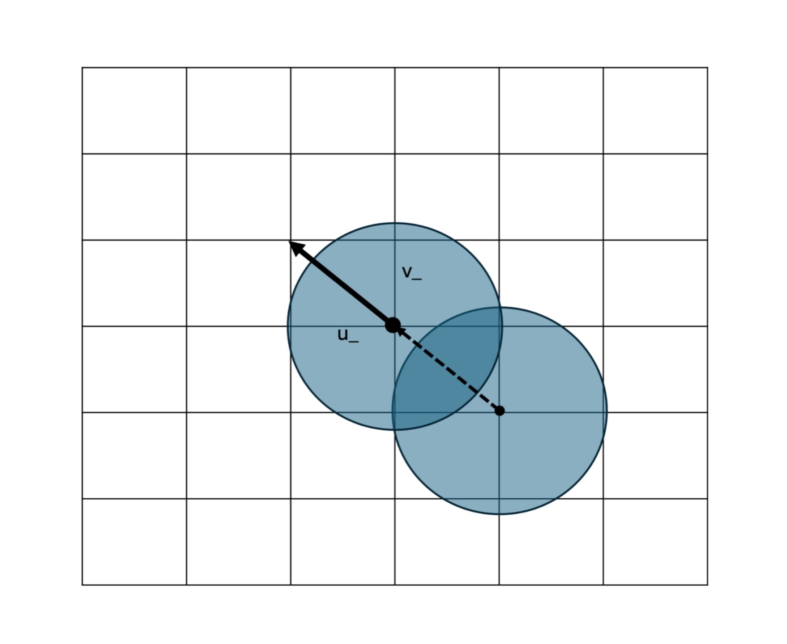

Tracking
=======================================================

Tracking Routine
--------------------------------------------------------

The tracking module is the core of pyForTraCC. It identifies clusters in a sequence of 2D
fields and follows them in time. The whole routine is configured by the ``name_list``
(see :doc:`BI_NAMELIST`) and reads the data with your read function (see :doc:`BI_DATA`):

.. code-block:: python

    import pyfortracc

    if __name__ == '__main__':
        pyfortracc.track(name_list, read_function)

The routine has four steps, run in sequence:

1. **Features extraction**: each file is segmented with every threshold. Contiguous pixels
   are grouped into clusters (``ndimage`` or ``DBSCAN``), clusters smaller than
   ``min_cluster_size`` are discarded, and each cluster gets a boundary polygon and
   statistics (size, min, mean, max, std).
2. **Spatial operations**: the clusters of each frame are overlaid with the clusters of the
   previous frame. Overlaps above ``min_overlap`` classify each cluster as new, continuous,
   split or merge. The displacement vector (``u_``, ``v_``) is the shift of the centroid, and the
   vector correction methods are applied.
3. **Cluster linking**: frame by frame, each cluster receives the unique identifier (``uid``) of
   the cluster it came from, or a new one. Its trajectory and lifetime are accumulated.
4. **Concatenation**: the results of the three steps are joined into the **tracking table**,
   one parquet file per time step in ``output_path + 'track/trackingtable/'``.

.. important::

   The tracking uses ``multiprocessing``. In Python scripts, put the calls inside an
   ``if __name__ == '__main__':`` block. In Jupyter notebooks on macOS and Windows, parallel
   processing is disabled automatically.

Arguments of track()
--------------------------------------------------------

.. code-block:: python

    pyfortracc.track(name_list, read_function,
                     parallel=True,     # use all cores (n_jobs in name_list)
                     feat_ext=True,     # run features extraction
                     spat_ope=True,     # run spatial operations
                     clst_lnk=True,     # run cluster linking
                     concat_r=True,     # build the tracking table
                     duration=False,    # also compute the total duration of each cluster
                     clean=True,        # delete output_path before starting
                     resume=False)      # continue an interrupted run

.. list-table::
   :header-rows: 1
   :widths: 18 12 70

   * - Argument
     - Default
     - Description
   * - ``parallel``
     - ``True``
     - Process files in parallel. The number of processes is ``name_list['n_jobs']``.
   * - ``feat_ext``, ``spat_ope``, ``clst_lnk``, ``concat_r``
     - ``True``
     - Enable or disable each step. Useful to re-run only part of the routine (use ``clean=False``).
   * - ``duration``
     - ``False``
     - Run ``post_processing.compute_duration`` at the end (adds the ``duration`` and
       ``genesis`` columns, see :doc:`BI_POSTPROCESSING`).
   * - ``clean``
     - ``True``
     - **Deletes the whole** ``output_path`` before tracking, including forecasts and exports.
       Set ``False`` to keep previous results.
   * - ``resume``
     - ``False``
     - Continue a run that was interrupted. See below.

Running the steps separately
~~~~~~~~~~~~~~~~~~~~~~~~~~~~~~~~~~~~~~~~~~~~~~~~~~~~~~~~

Each step is also available as a function. Intermediate results are kept in
``output_path + 'track/processing/'`` (``features/``, ``spatial/``, ``linked/``) until the
concatenation. This is useful to understand the algorithm or to inspect a step:

.. code-block:: python

    if __name__ == '__main__':
        pyfortracc.features_extraction(name_list, read_function)
        pyfortracc.spatial_operations(name_list, read_function)
        pyfortracc.cluster_linking(name_list)
        pyfortracc.concat(name_list, clean=True)   # clean=False keeps processing/

Resuming an interrupted run
~~~~~~~~~~~~~~~~~~~~~~~~~~~~~~~~~~~~~~~~~~~~~~~~~~~~~~~~

Long runs (years of data, global domains) can be stopped by a crash, a time limit on a
cluster or a lack of memory. Run ``track`` again with ``resume=True`` and the **same**
``name_list``:

.. code-block:: python

    pyfortracc.track(name_list, read_function, resume=True)

Each step skips the files that were already completely written, and the cluster linking
continues from the last linked frame, so ``uid`` values stay consistent. Files that were only partially
written are processed again. When calling the steps separately, set
``name_list['resume'] = True`` instead.

Output folder
--------------------------------------------------------

.. code-block:: text

    output_path/
    └── track/
        ├── trackingtable/          # the tracking table: one parquet per time step
        │   ├── 20140816_1000.parquet
        │   ├── 20140816_1012.parquet
        │   └── ...
        └── processing/             # intermediate files (removed after the concatenation)
            ├── features/
            ├── spatial/
            └── linked/

Other folders are added by the forecast (``forecast/``) and by the post-processing and
export functions (``geometry/``, ``clusters/``, ``raster/``, ``spatial_vectors/``, ``family/``).

Tracking Table
--------------------------------------------------------

The tracking table is the main output of the algorithm. Each parquet file contains all
clusters of one time step, and **each row is one cluster at one threshold level**. Read it with
pandas:

.. code-block:: python

  import pandas as pd
  import glob

  tracking_files = sorted(glob.glob(name_list['output_path'] + 'track/trackingtable/*.parquet'))
  tracking_table = pd.concat(pd.read_parquet(f) for f in tracking_files)
  tracking_table.head()

For large datasets, read only the columns you need, or use Dask or DuckDB:

.. code-block:: python

  columns = ['timestamp', 'uid', 'threshold_level', 'status', 'size', 'lifetime', 'mean', 'max']
  tracking_table = pd.concat(pd.read_parquet(f, columns=columns) for f in tracking_files)

  # or, lazily, with Dask
  import dask.dataframe as dd
  tracking_table = dd.read_parquet(name_list['output_path'] + 'track/trackingtable/*.parquet')

Columns
~~~~~~~~~~~~~~~~~~~~~~~~~~~~~~~~~~~~~~~~~~~~~~~~~~~~~~~~

.. list-table::
   :header-rows: 1
   :widths: 20 80

   * - Column
     - Description
   * - ``cindex`` (index)
     - Row index, unique across all files of the tracking table.
   * - ``timestamp``
     - Time of the frame.
   * - ``uid``
     - Unique identifier of the cluster. It stays the same during the cluster's whole life.
   * - ``iuid``
     - Internal identifier of the clusters of higher thresholds (only when more than one
       threshold is used). An inner cluster carries the ``uid`` of the outer system that contains it,
       and ``iuid`` identifies the inner cluster itself (e.g. ``12.0345``: the integer part is
       the ``uid`` of the outer system).
   * - ``threshold_level``, ``threshold``
     - Position of the threshold in the ``thresholds`` list (0, 1, ...) and its value.
   * - ``status``
     - Event of the cluster in this frame (see :ref:`Cluster status <BI/BI_TRACKING:Cluster status>`).
   * - ``size``
     - Area of the cluster in pixels. Multiply by the pixel area to get km².
   * - ``lifetime``
     - Age of the cluster in minutes. It is ``delta_time`` in the first frame and grows with
       each linked frame.
   * - ``expansion``
     - Normalized area expansion rate, in 10⁻⁶ s⁻¹:
       ``(1 / mean_area) × (Δarea / Δt) × 10⁶``. Positive values mean growth, negative values
       decay. For infrared tracking it indicates cloud-top divergence/convergence.
   * - ``min``, ``mean``, ``max``, ``std``
     - Statistics of the input values inside the cluster.
   * - ``u_``, ``v_``
     - Displacement vector of the cluster since the previous frame (see below).
   * - ``inside_clusters``
     - Number of clusters of higher thresholds inside this cluster.
   * - ``board``
     - ``True`` when the cluster touches the domain border (with ``edges = True``).
   * - ``cluster_id``
     - Label of the cluster in the segmented image of that frame.
   * - ``file``
     - Input file of the frame.
   * - ``array_values``, ``array_y``, ``array_x``
     - Values and row/column indices of every pixel of the cluster (only with
       ``save_arrays = True``).
   * - ``trajectory``
     - Line (WKT) from the centroid in the previous frame to the current centroid.
   * - ``geometry``
     - Boundary polygon of the cluster (WKT), in pixels or in longitude/latitude.
   * - ``past_idx``
     - ``cindex`` of the cluster in the previous frame that this cluster continues.
   * - ``merge_idx``
     - ``cindex`` values of the clusters that merged into this one.
   * - ``split_pr_idx``
     - ``cindex`` of the previous cluster that split to form this one.

Some columns are added by options of the ``name_list``:

* ``u_spl``, ``v_spl``, ``u_mrg``, ``v_mrg``, ``u_inc``, ``v_inc``, ``u_opt``, ``v_opt``,
  ``opt_field``, ``u_elp``, ``v_elp``, ``u_new``, ``v_new``: vector corrections (see below).
* ``method``, ``far`` (``validation``); ``u_noc``, ``v_noc``, ``hit_*``, ``false-alarm_*``,
  ``far_*`` (``validation_scores``).
* ``prv_mrg_uids``, ``prv_mrg_iuids``, ``prv_spl_uid``, ``prv_spl_iuid`` (``prv_uid``).
* ``duration``, ``genesis`` and any column added by the post-processing functions.

Geometry columns are stored as WKT text. Convert them to shapely objects to use geopandas:

.. code-block:: python

  import geopandas as gpd
  from shapely import wkt

  gdf = gpd.GeoDataFrame(tracking_table,
                         geometry=tracking_table['geometry'].apply(wkt.loads),
                         crs='EPSG:4326')   # only when geographic bounds are used

Cluster status
~~~~~~~~~~~~~~~~~~~~~~~~~~~~~~~~~~~~~~~~~~~~~~~~~~~~~~~~

.. list-table::
   :header-rows: 1
   :widths: 15 85

   * - Status
     - Meaning
   * - ``NEW``
     - The cluster does not overlap any cluster of the previous frame: a new system (initiation).
   * - ``CON``
     - Continuity: the cluster overlaps exactly one cluster of the previous frame.
   * - ``SPL``
     - Split: the previous cluster broke into several pieces. This is the piece that keeps the
       ``uid`` of the previous cluster.
   * - ``NEW/SPL``
     - A piece created by a split. It receives a new ``uid`` (with ``split_pr_idx`` pointing to
       the parent cluster).
   * - ``MRG``
     - Merge: several clusters of the previous frame joined into this one. It keeps the ``uid``
       of one of them (listed in ``merge_idx``).
   * - ``MRG/SPL``
     - Merge and split happened at the same time.

Example: follow the life of the longest-lived cluster.

.. code-block:: python

  first_threshold = tracking_table[tracking_table['threshold_level'] == 0]
  uid = first_threshold.groupby('uid')['lifetime'].max().idxmax()
  life = first_threshold[first_threshold['uid'] == uid]
  print(life[['timestamp', 'status', 'size', 'mean', 'max', 'lifetime']])
  life.plot(x='timestamp', y='size', marker='o')

Displacement vectors
--------------------------------------------------------

The ``u_`` and ``v_`` components are the displacement of the cluster centroid between the previous
frame and the current one (``u_`` along x/longitude, ``v_`` along y/latitude). Their units
are those of the grid **per time step** (``delta_time``): pixels without geographic bounds, degrees
with ``lat_min``/``lat_max``/``lon_min``/``lon_max``. To get a speed, convert the
displacement to distance and divide by ``delta_time``. For example, near the equator:

.. code-block:: python

  import numpy as np
  deg_to_km = 111.32
  dist_km = np.hypot(tracking_table['u_'] * deg_to_km * np.cos(np.radians(lat_center)),
                     tracking_table['v_'] * deg_to_km)
  speed_kmh = dist_km / (name_list['delta_time'] / 60)

Clusters with status ``NEW`` (and ``NEW/SPL``) have no previous position, so their vector is
``NaN`` unless a correction method estimates one.

Vector correction methods
~~~~~~~~~~~~~~~~~~~~~~~~~~~~~~~~~~~~~~~~~~~~~~~~~~~~~~~~

Because the tracking is based on overlap and centroids, the vector is distorted when a cluster
changes shape, which is common for non-rigid objects such as clouds and rain cells. pyForTraCC
implements correction methods that compute alternative vectors, each stored in its own
columns:

.. list-table::
   :header-rows: 1
   :widths: 25 20 55

   * - Option
     - Columns
     - Method
   * - ``spl_correction``
     - ``u_spl``, ``v_spl``
     - Split events: vector from the centroid of the parent cluster to each piece.
   * - ``mrg_correction``
     - ``u_mrg``, ``v_mrg``
     - Merge events: combines the vectors of the clusters that merged.
   * - ``inc_correction``
     - ``u_inc``, ``v_inc``
     - Inner cores: uses the displacement of the clusters of higher thresholds inside the
       cluster, which tend to be more stable.
   * - ``opt_correction``
     - ``u_opt``, ``v_opt``, ``opt_field``
     - Optical flow (Lucas-Kanade or Farneback, ``opt_mtd``) computed on the input images.
   * - ``elp_correction``
     - ``u_elp``, ``v_elp``
     - Displacement of the centroid of an ellipse fitted to the cluster.
   * - ``new_correction``
     - ``u_new``, ``v_new``
     - ``NEW`` clusters: mean vector of the ``new_neighbors`` nearest clusters.

With ``validation = True``, each method is evaluated for every cluster. The previous
cluster is shifted by each candidate vector and compared with the current cluster, and the
method with the lowest false alarm ratio (FAR) is chosen. Its vector replaces ``u_``/``v_``, its
name is saved in ``method`` (``noc`` = no correction, ``spl``, ``mrg``, ``inc``, ``opt``,
``elp``, ``new``) and its score in ``far``. Downstream steps such as the forecast use the best
vector automatically.

.. code-block:: python

  name_list['spl_correction'] = True
  name_list['mrg_correction'] = True
  name_list['inc_correction'] = True
  name_list['opt_correction'] = True
  name_list['validation'] = True

  pyfortracc.track(name_list, read_function)

  # Which method was chosen most often?
  tracking_table['method'].value_counts()

The methods and their evaluation over the Amazon basin are described in
:doc:`../CF/CORRECTION` and in `Leal et al. (2022) <https://doi.org/10.3390/rs14215408>`_.

For examples with real data, see :doc:`BI_EXAMPLES`.
