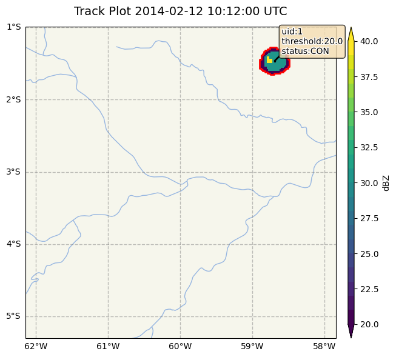
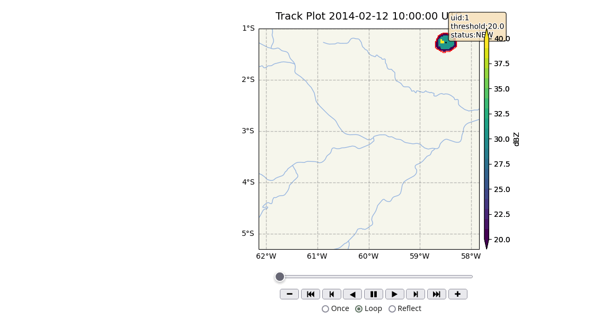

Utilities
=======================================================

Track Visualization
-------------------------------------------------------

To check the tracking results visually, the PyForTraCC library provides a visualization module. This module enables you to view 
the tracking results based on data in the tracking table. Before calling the ``plot`` and ``plot_animation`` functions, make sure 
to add geospatial information to the ``name_list`` configuration.

**Example: Static Plot**

The following code generates a static plot of the tracked rain cells at a specific timestamp.

.. code-block:: python

    pyfortracc.plot(timestamp='2014-02-12 10:12:00', name_list=name_list, read_function=read_function,
                    cbar_title='dBZ', info=True, grid_deg=None)

**Example: Animated Plot**

To create an animated visualization of the tracking data, use the ``plot_animation`` function. This function generates a sequence 
of plots over a specified time range, allowing you to observe changes in the tracked rain cells over time.

.. code-block:: python

    pyfortracc.plot_animation(read_function=read_function, name_list=name_list, 
                                figsize=(14,5), cbar_title='dBZ',
                                threshold_list=[20], grid_deg=None,
                                info=True, info_col_name=True, 
                                start_stamp='2014-02-12 10:00:00', 
                                end_stamp='2014-02-12 14:12:00')

Spatial Conversion
-------------------------------------------------------

The library includes a ``spatial_conversions`` utility that enables conversion of data from the ``tracking_table`` to popular geospatial formats such as NetCDF, TIFF, Shapefiles, and GeoJSON. To use this module, additional spatial information must be added to the ``name_list``, including grid size and geospatial coordinates.

These utility functions enhance the usability of PyForTraCC by facilitating both data visualization and data format compatibility with other geospatial tools.

