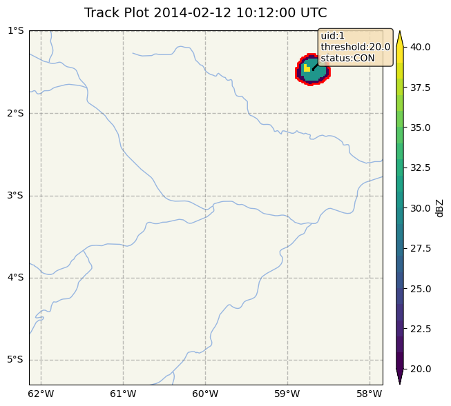
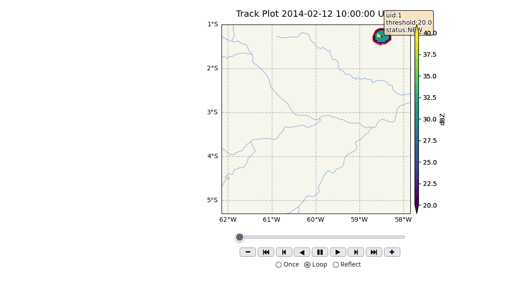

Utilities
=======================================================

Track Visualization
-------------------------------------------------------

pyForTraCC has two plotting functions that read the tracking table and draw the clusters over
the input data:

* ``pyfortracc.plot``: one time step;
* ``pyfortracc.plot_animation``: an animation over a period, or a preview of the input files.

Both use the ``name_list`` of the tracking. With geographic bounds (``lon_min``, ``lon_max``,
``lat_min``, ``lat_max``) the clusters are drawn on a map (cartopy) with coastlines and
borders. Without them, a simple image in pixel coordinates is drawn.

Static plot
~~~~~~~~~~~~~~~~~~~~~~~~~~~~~~~~~~~~~~~~~~~~~~~~~~~~~~~

.. code-block:: python

    pyfortracc.plot(name_list, read_function, timestamp='2014-02-12 10:12:00',
                    cbar_title='dBZ', info=True, info_cols=['uid', 'status'])

The ``timestamp`` must match a file of the tracking table.

Animation
~~~~~~~~~~~~~~~~~~~~~~~~~~~~~~~~~~~~~~~~~~~~~~~~~~~~~~~

``plot_animation`` creates an animation between ``start_timestamp`` and ``end_timestamp`` and
returns an HTML object that is displayed in Jupyter.

.. code-block:: python

    pyfortracc.plot_animation(name_list=name_list, read_function=read_function,
                              start_timestamp='2014-02-12 10:00:00',
                              end_timestamp='2014-02-12 14:12:00',
                              figsize=(14, 5), cbar_title='dBZ',
                              threshold_list=[20],
                              info=True, info_cols=['uid', 'lifetime'])

To check the input data **before** tracking, pass ``path_files`` instead of ``name_list``:

.. code-block:: python

    pyfortracc.plot_animation(path_files='input/*.nc', read_function=read_function,
                              num_frames=20, cmap='viridis')

To save the animation to a file, keep the returned object and write its HTML:

.. code-block:: python

    anim = pyfortracc.plot_animation(name_list=name_list, read_function=read_function,
                                     start_timestamp='2014-02-12 10:00:00',
                                     end_timestamp='2014-02-12 14:12:00')
    with open('tracking.html', 'w') as f:
        f.write(anim.data)

Main plotting options
~~~~~~~~~~~~~~~~~~~~~~~~~~~~~~~~~~~~~~~~~~~~~~~~~~~~~~~

The same options are accepted by ``plot`` and ``plot_animation``.

.. list-table::
   :header-rows: 1
   :widths: 28 72

   * - Option
     - Description
   * - ``uid_list``
     - Show only these clusters, e.g. ``[12, 45]``.
   * - ``threshold_list``
     - Show only these thresholds (values, not levels), e.g. ``[20]``.
   * - ``zoom_region``
     - ``[lon_min, lon_max, lat_min, lat_max]`` of the area to show.
   * - ``info``, ``info_cols``, ``info_col_name``
     - Label each cluster with the values of the given columns of the tracking table (e.g.
       ``['uid', 'status', 'lifetime']``).
   * - ``boundary``, ``bound_color``, ``bound_linewidth``
     - Draw the cluster boundaries.
   * - ``trajectory``, ``traj_color``, ``traj_linewidth``, ``smooth_trajectory``
     - Draw the trajectory of each cluster.
   * - ``centroid``, ``centr_color``, ``centr_size``
     - Mark the centroids.
   * - ``vector``, ``vector_scale``, ``vector_color``
     - Draw the displacement vector (``u_``, ``v_``). Increase ``vector_scale`` to make the
       arrows longer.
   * - ``cmap``, ``min_val``, ``max_val``, ``num_colors``
     - Colormap and color range of the input data.
   * - ``cbar``, ``cbar_title``
     - Show the colorbar and set its title.
   * - ``grid_deg``
     - Spacing of the latitude/longitude grid lines, in degrees.
   * - ``background``
     - Map background: ``'default'`` (coastlines and borders), ``'stock'`` (cartopy stock image),
       ``'satellite'`` or ``'google'`` (web map tiles, require internet access).
   * - ``scalebar``, ``scalebar_metric``, ``scalebar_units``
     - Draw a scale bar of the given length (e.g. ``100`` km).
   * - ``title``, ``time_zone``, ``figsize``
     - Title, time zone label and figure size.
   * - ``save``, ``save_path``, ``save_name``
     - Save the figure as an image (``plot``). Without ``save_name``, the file is named after
       the timestamp.

Example with more options:

.. code-block:: python

    pyfortracc.plot(name_list, read_function, '2022-01-01 00:50:00',
                    cmap='turbo',
                    zoom_region=[-60, -30, 0, 20],
                    uid_list=[272, 206],
                    info=True, info_cols=['uid', 'status', 'lifetime'],
                    vector=True, vector_scale=20, vector_color='w',
                    save=True, save_path='figures/', save_name='track_0050.png')

Spatial Conversion
-------------------------------------------------------

``pyfortracc.spatial_conversions`` exports the tracking table to geospatial formats: polygons
and trajectories as GeoJSON/Shapefile/GeoPackage, and cluster masks as NetCDF. These files can be
opened in QGIS, ArcGIS, geopandas or xarray. It requires the geographic bounds in the ``name_list``.

.. code-block:: python

    pyfortracc.spatial_conversions(name_list, read_function,
                                   boundary=True, trajectory=True, cluster=True,
                                   driver='GeoJSON')

All options and the other export functions are described in :doc:`BI_POSTPROCESSING`.

Unit conversions
-------------------------------------------------------

``pyfortracc.utilities.conversions`` provides conversions between radar reflectivity and
rainfall rate, based on the Z–R relation ``Z = a R^b`` (Marshall–Palmer: ``a = 200``,
``b = 1.6``):

.. code-block:: python

    import numpy as np
    from pyfortracc.utilities.conversions import dbz2mmh, mmh2dbz, dbz2mm6m3, mm6m32dbz

    dbz2mmh(np.array([20, 30, 40]))          # dBZ -> mm/h: [0.65, 2.73, 11.53]
    mmh2dbz(np.array([1.0, 10.0]))           # mm/h -> dBZ
    dbz2mmh(np.array([35]), a=300, b=1.4)    # other Z-R relations
    dbz2mm6m3(np.array([30]))                # dBZ -> Z (mm⁶/m³)

A common use is to track in rain rate units while reading reflectivity:

.. code-block:: python

    def read_function(path):
        dbz = xr.open_dataarray(path).data
        return dbz2mmh(dbz)                  # thresholds are then given in mm/h

Synthetic data
-------------------------------------------------------

``pyfortracc.utilities.bubble_simulation`` generates a small synthetic dataset for tests
and teaching: 30 PNG images (50 × 50 pixels, one per minute) of a bubble that moves, splits,
merges and dissipates.

.. code-block:: python

    pyfortracc.utilities.bubble_simulation(dir='input/')

See :doc:`BI_QUICKSTART` for a complete workflow using this dataset.
