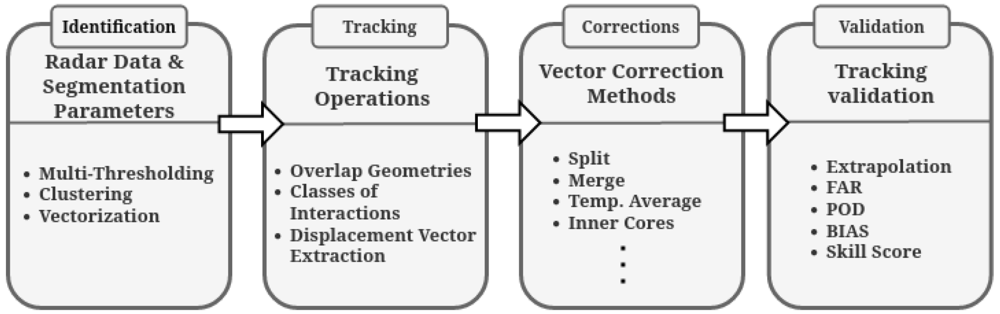

Algorithm
=======================================================

Various techniques can be used to track non-rigid objects like rain cells [1]_ [2]_ [3]_ [4]_ [5]_ [6]_ [7]_ [8]_ [9]_. This algorithm applies geometry overlapping methods to 
track and forecast individual rain cells from satellites or radar data, considering their interactions during development and movement. Key 
parameters like minimum size and identification thresholds must be defined for tracking rain systems. These parameters impact the average size, 
internal structure, and lifetime of the systems. Several steps are involved to ensure effective tracking.

The algorithm workflow consists of four stages: identification, tracking, corrections, and forecast. In the identification stage, rain clusters 
(rain cells) are detected and converted into vector objects (polygons). The tracking stage involves comparing geometries at consecutive times to 
determine cell displacement. Corrections may be necessary to address unrealistic displacement vectors caused by shape changes, cell fusion,
splitting, or radar errors. The forecast stage validates the correction method by predicting rain cell movement using the corrected vectors and 
comparing it to observed data. This conservative validation assumes minimal changes in subsequent observations. The next sections provide more 
details on specific algorithm modules.

    Flowchart of the method applied for tracking and validation of the precipitating systems (Font: Leal HB Et al. 2022). 

.. [1] Crane, R.K. Automatic cell detection and tracking. IEEE Trans. Geosci. Electron. 1979, 17, 250–262.
.. [2] Vila, D.A.; Machado, L.A.; Laurent, H.; Velasco, I. Forecast and Tracking the Evolution of Cloud Clusters (ForTraCC) using satellite infrared imagery: Methodology and validation. Weather Forecast. 2008, 23, 233–245.
.. [3] Dixon, M.; Wiener, G. TITAN: Thunderstorm identification, tracking, analysis, and nowcasting—A radar-based methodology. Weather Forecast. 1993, 10, 785–797.
.. [4] Lakshmanan, V.; Smith, T. An objective method of evaluating and devising storm-tracking algorithms. Am. Meteorol. Soc. Weather Forecast. 2010, 25, 701–709.
.. [5] Han, L.; Fu, S.; Zhao, L.; Zheng, Y.; Wang, H.; Lin, Y. 3D convective storm identification, tracking, and forecasting—An enhanced TITAN algorithm. J. Atmos. Ocean. Technol. 2009, 26, 719–732.
.. [6] Sieglaff, J.; Hartung, D.; Feltz, W.; Cronce, L.; Lakshmanan, V. A satellite-based convective cloud object tracking and multipurpose data fusion tool with application to developing convection. Am. Meteorol. Soc. J. Atmos. Ocean. Technol. 2013, 30, 510–525.
.. [7] Rinehart, R.E.; Garvey, E.T. Three-dimensional storm motion detection by conventional weather radar. Nature 1978, 273, 287–289.
.. [8] Fiolleau, T.; Roca, R. An algorithm for the detection and tracking of tropical mesoscale convective systems using infrared images from geostationary satellite. IEEE Trans. Geosci. Remote Sens. 2013, 51, 4302–4315.
.. [9] Shehu, B.; Haberlandt, U. Improving radar-based rainfall nowcasting by a nearest-neighbour approach–Part 1: Storm characteristics. Copernic. GmbH Hydrol. Earth Syst. Sci. 2022, 26, 1631–1658.