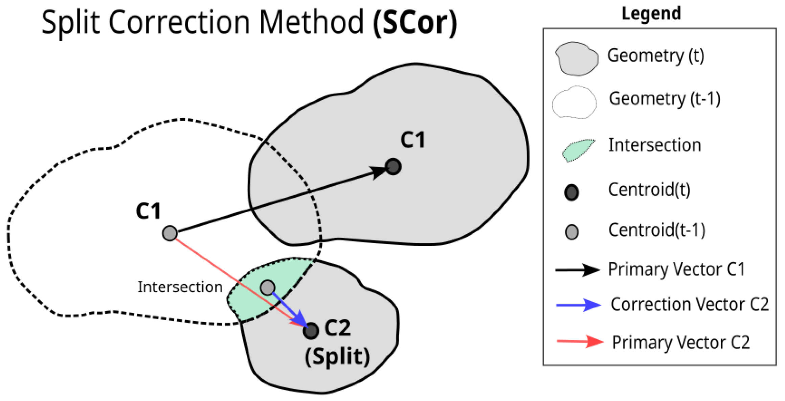
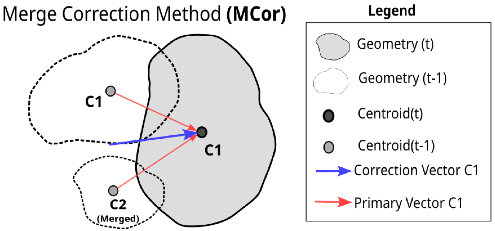
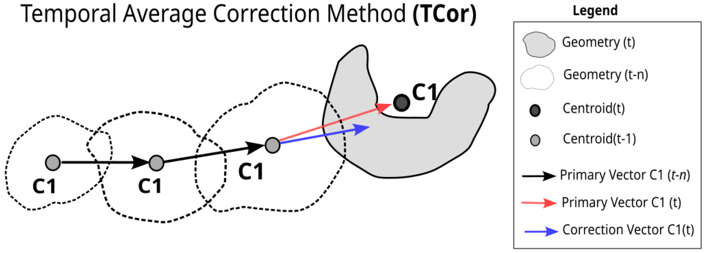
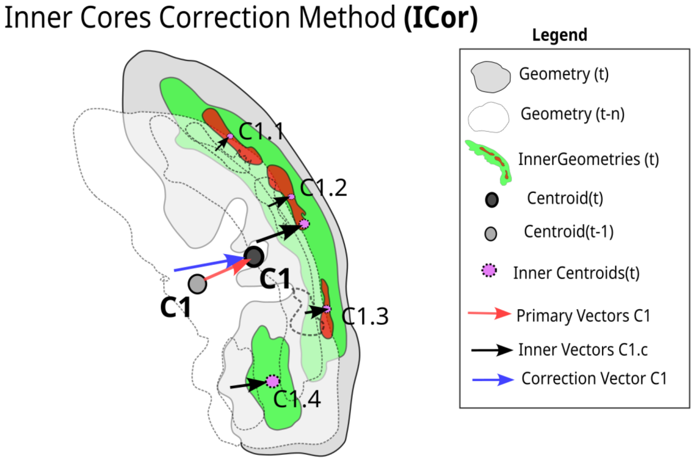

Correction
=======================================================

Several factors can modify rain cell movement when analyzing their trajectory. One of these factors that can affect a reasonable estimate 
of displacement trajectory is the use of a centroid as a target. This problem is associated with the shape of tracked objects and processes 
of mergers and splits that may occur during the development of precipitating systems. According to [1]_, this problem comes from an object tracking 
perspective with multiple merging and splitting events for non-rigid objects.

Correction for Rain Cell Split
****************************************************

The proposed vector correction method adds a new vector for a newly generated cell. This displacement vector starts from the centroid of the 
intersecting area between the rain cell at :math:`t-1` and a cell at time :math:`t` generated after a Split, instead of from the centroid related 
to the rain cell in :math:`t`. 

Figure below shows the visualization scheme for how the Split Correction method (SCor) works. It is believed that this type of correction will have 
the most significant impact on storm events that have deep convective cores with different directions, common in supercells [2]_. Moreover, fragmentation 
of rain cells is frequent in the dissipation stages and may take advantage of this type of correction [3]_. So this method solves a specific case: new smaller 
cells that arise from a split.

    Schematic for the Split Correction method. The green polygon is the intersection geometries for the New Split rain cell. The arrows indicate the 
    displacement vectors used in the SCor method, where the red arrow is the vector used for the adjustment and the blue arrow is the displacement 
    vector adjusted by the method (Font: Leal HB Et al. 2022). 

Correction for Rain Cell Merge
****************************************************

Throughout a precipitating system’s life cycle, it is common for it to merge with nearby cells. This may occur due to several factors, such as larger 
systems propagating by absorbing new systems ahead [4]_, faster systems joining with slower systems, etc. Moreover, depending on the threshold applied for 
tracking, cell joining can also occur in multicell systems, where nearby convective cores at different stages of maturation can be merged [5]_. 

Considering this feature, the Merge Correction Method (MCor) is applied to correct displacement in rain cell merge. The method uses a simple approach, 
where a set of vectors between the current observation time (:math:`t`) and vectors from the previous time (:math:`t-1`) can define a correction for 
the current displacement vector :math:`\vec{V_t}`. 

In Figure bellow, we visualize how the MCor method carries out correction by replacing a vector during an event of cell–cell merging. The filled gray 
polygon represents the cell at the current time :math:`t` and its corresponding vector before the correction (red arrow); the polygon at the previous 
time (:math:`t-1`) is represented without the fill (transparent polygon). For rain cell merge, the interaction vectors between cells that precede the 
merge are considered, meaning that in Figure bellow, the red arrow represents the primary vector coming from the interaction between geometries at :math:`t` 
and :math:`t-1`, and the blue arrow is the correction vector made by MCor. The blue vector is the average of these red vectors (equation bellow).

.. math:: 
    \vec{V}_{avg} = \frac{1}{n} \sum_{i=1}^{n} \vec{V}_{i}

    Merge Correction Method scheme. The arrows indicate the displacement vectors associated with the method, where red arrows are the vectors used for 
    the adjustment and the blue arrow is the displacement vector adjusted by the method.

Temporal Average Correction Based on the Life Cycle
****************************************************

The displacement vector often suffers abrupt changes in the values of velocity and direction caused by many circumstances, such as data gaps, sudden 
changes in the shape of rain cell polygons, holes in the polygons, and/or merging/splitting of systems. 

Assuming that the trajectories of a system over its lifespan within a limited area should not change abruptly, the Temporal Average Vector Correction 
(TCor) method is based on the complete life cycle of a precipitating system. The previous equation was also applied to define the average. This method 
uses vectors related to a certain period of the precipitating system life cycle observations to correct an unrealistic vector of the rain cell at the time 
of the current observation. Figure bellow demonstrates the TCor method for correcting a displacement vector at the current time.

    Schematic for temporal average vector correction method. The cells of observations before t are represented by unfilled polygons with their respective 
    displacement vectors (black arrows). 

Correction by Rain Cell Inner Cores
****************************************************

As previously mentioned, a problem with changing the tracked system’s shape can appear in many different ways and abruptly. However, internal cores can 
represent a solution to this problem. Because they are smaller in area and displacement, the observed variations can better describe the system’s 
displacement at a given instant. 

In this case, a correction method using vectors associated with the Inner Cores (ICor) of the rain cells can be applied to correct the trajectory at the 
current time. This method outputs correction vectors associated with the displacement of the cell sorted by the first threshold at time (:math:`t`). 

Figure bellow illustrates how this method adjusts the displacement vector, the grey polygon represents the geometry of the primary threshold boundary, 
while smaller polygons (purple) represent geometries of internal thresholds (more intense reflectivity thresholds) and their respective displacement vectors. 
The adjusted vector (blue arrow) is the averaged vector (Previous equation) related to the inner cores (black arrow). It replaces the primary vector related 
to the outer threshold (red arrow).

    Schematic for Inner Cores method. The black arrows represent the displacement vectors for each inner cell. The average of black arrows is the blue 
    arrow which replaces the primary displacement vector (red arrow).

Combination
****************************************************

All the above methods act on a specific condition, sometimes trying to improve the split vector, sometimes the merges, among other things. However, 
in the same rain cell, there are several conditions to apply different methods at the same time; in this case, we also evaluate these groups (combinations), 
even counting how many times they occur (activation). 

In addition, there is still the fact that not all tracking problems were accounted for, not only for the lack of knowledge of all the questions that 
involve the tracking of rain cells, but for the fact that sometimes the vector to be corrected is, in fact, the most realistic one. So, all the above 
methods were combined with the uncorrected vector, here called “NONE”. 

.. [1] Storlie, C.B.; Lee, T.C.M.; Hannig, J.; Nychka, D. Tracking of multiple merging and splitting targets: A statistical perspective. Stat. Sin. 2009, 19, 1–31.
.. [2] Houze, R.A. Structure and dynamics of a tropical squall–line system. Am. Meteorol. Soc. Mon. Weather Rev. 1977, 105, 1540–1567.
.. [3] Garstang, M.; Massie, H.L.; Halverson, J.; Greco, S.; Scala, J. Amazon coastal squall lines. Part I: Structure and kinematics. Mon. Weather Rev. 1994, 122, 608–622.
.. [4] Cotton, W.R.; Anthes, R.A. Storm and Cloud Dynamics; Academic Press: Cambridge, MA, USA, 1992.
.. [5] Houze, R.A. Structure and dynamics of a tropical squall–line system. Am. Meteorol. Soc. Mon. Weather Rev. 1977, 105, 1540–1567.

