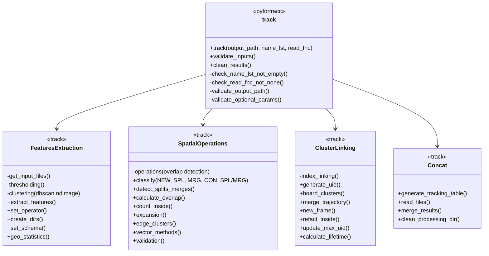

```mermaid
---
config:
  theme: mc
  look: classic
---
classDiagram
direction TB
    class FeaturesExtraction {
	    -get_input_files()
	    -thresholding()
	    -clustering(dbscan ndimage)
	    +extract_features()
	    +set_operator()
	    +create_dirs()
	    +set_schema()
	    +geo_statistics()
    }
    class track {
	    +track(output_path, name_lst, read_fnc)
	    +validate_inputs()
	    +clean_results()
	    -check_name_lst_not_empty()
	    -check_read_fnc_not_none()
	    -validate_output_path()
	    -validate_optional_params()
    }
    class SpatialOperations {
	    -operations(overlap detection)
	    +classify(NEW, SPL, MRG, CON, SPL/MRG)
	    +detect_splits_merges()
	    +calculate_overlap()
	    +count_inside()
        +expansion()
	    +edge_clusters()
        +vector_methods()
        +validation()
    }
    class ClusterLinking {
	    -index_linking()
	    +generate_uid()
	    +board_clusters()
	    +merge_trajectory()
	    +new_frame()
	    +refact_inside()
	    +update_max_uid()
	    +calculate_lifetime()
    }
    class Concat {
	    +generate_tracking_table()
	    +read_files()
	    +merge_results()
	    +clean_processing_dir()
    }

	<<track>> FeaturesExtraction
	<<pyfortracc>> track
	<<track>> SpatialOperations
	<<track>> ClusterLinking
	<<track>> Concat

    track --> FeaturesExtraction
    track --> SpatialOperations
    track --> ClusterLinking
    track --> Concat

```
