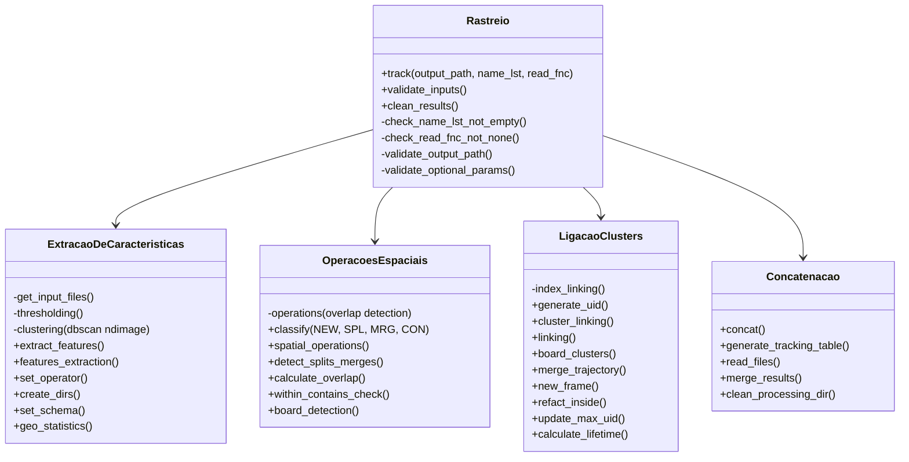

```mermaid
classDiagram
    %% Classe principal
    class Rastreio {
        +track(output_path, name_lst, read_fnc)
        +validate_inputs()
        +clean_results()
        -check_name_lst_not_empty()
        -check_read_fnc_not_none()
        -validate_output_path()
        -validate_optional_params()
    }

    %% Módulos principais em sequência
    class ExtracaoDeCaracteristicas {
        -get_input_files()
        -thresholding()
        -clustering(dbscan ndimage)
        +extract_features()
        +features_extraction()
        +set_operator()
        +create_dirs()
        +set_schema()
        +geo_statistics()
    }

    class OperacoesEspaciais {
        -operations(overlap detection)
        +classify(NEW, SPL, MRG, CON)
        +spatial_operations()
        +detect_splits_merges()
        +calculate_overlap()
        +within_contains_check()
        +board_detection()
    }

    class LigacaoClusters {
        -index_linking()
        +generate_uid()
        +cluster_linking()
        +linking()
        +board_clusters()
        +merge_trajectory()
        +new_frame()
        +refact_inside()
        +update_max_uid()
        +calculate_lifetime()
    }

    class Concatenacao {
        +concat()
        +generate_tracking_table()
        +read_files()
        +merge_results()
        +clean_processing_dir()
    }

    %% Relacionamentos principais
    Rastreio --> ExtracaoDeCaracteristicas
    Rastreio --> OperacoesEspaciais
    Rastreio --> LigacaoClusters
    Rastreio --> Concatenacao
```