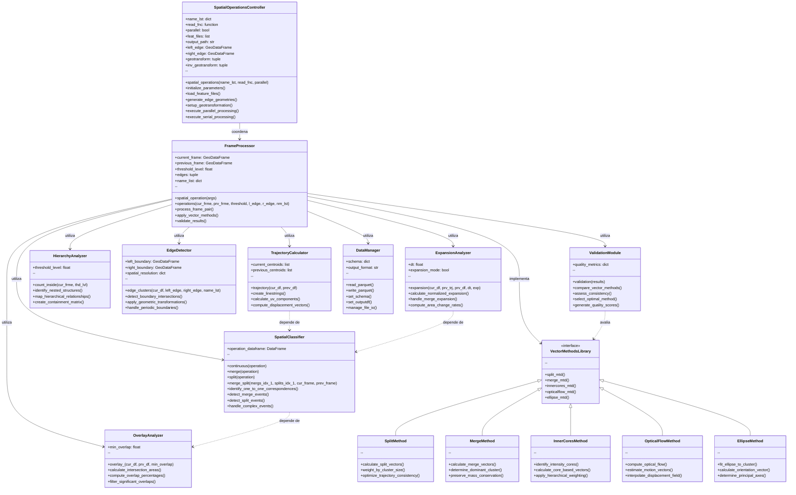

```mermaid
---
config:
  theme: mc
  look: classic
---
classDiagram
    class SpatialOperationsController {
        +name_lst: dict
        +read_fnc: function
        +parallel: bool
        +feat_files: list
        +output_path: str
        +left_edge: GeoDataFrame
        +right_edge: GeoDataFrame
        +geotransform: tuple
        +inv_geotransform: tuple
        --
        +spatial_operations(name_lst, read_fnc, parallel)
        +initialize_parameters()
        +load_feature_files()
        +generate_edge_geometries()
        +setup_geotransformation()
        +execute_parallel_processing()
        +execute_serial_processing()
    }

    class FrameProcessor {
        +current_frame: GeoDataFrame
        +previous_frame: GeoDataFrame
        +threshold_level: float
        +edges: tuple
        +name_list: dict
        --
        +spatial_operation(args)
        +operations(cur_frme, prv_frme, threshold, l_edge, r_edge, nm_lst)
        +process_frame_pair()
        +apply_vector_methods()
        +validate_results()
    }

    class OverlayAnalyzer {
        +min_overlap: float
        --
        +overlay_(cur_df, prv_df, min_overlap)
        +calculate_intersection_areas()
        +compute_overlap_percentages()
        +filter_significant_overlaps()
    }

    class SpatialClassifier {
        +operation_dataframe: DataFrame
        --
        +continuous(operation)
        +merge(operation)
        +split(operation)
        +merge_split(mergs_idx_1, splits_idx_1, cur_frame, prev_frame)
        +identify_one_to_one_correspondences()
        +detect_merge_events()
        +detect_split_events()
        +handle_complex_events()
    }

    class TrajectoryCalculator {
        +current_centroids: list
        +previous_centroids: list
        --
        +trajectory(cur_df, prev_df)
        +create_linestrings()
        +calculate_uv_components()
        +compute_displacement_vectors()
    }

    class ExpansionAnalyzer {
        +dt: float
        +expansion_mode: bool
        --
        +expansion(cur_df, prv_trj, prv_df, dt, exp)
        +calculate_normalized_expansion()
        +handle_merge_expansion()
        +compute_area_change_rates()
    }

    class HierarchyAnalyzer {
        +threshold_level: float
        --
        +count_inside(cur_frme, thd_lvl)
        +identify_nested_structures()
        +map_hierarchical_relationships()
        +create_containment_matrix()
    }

    class EdgeDetector {
        +left_boundary: GeoDataFrame
        +right_boundary: GeoDataFrame
        +spatial_resolution: dict
        --
        +edge_clusters(cur_df, left_edge, right_edge, name_lst)
        +detect_boundary_intersections()
        +apply_geometric_transformations()
        +handle_periodic_boundaries()
    }

    class VectorMethodsLibrary {
        <<interface>>
        --
        +split_mtd()
        +merge_mtd()
        +innercores_mtd()
        +opticalflow_mtd()
        +ellipse_mtd()
    }

    class SplitMethod {
        --
        +calculate_split_vectors()
        +weight_by_cluster_size()
        +optimize_trajectory_consistency()
    }

    class MergeMethod {
        --
        +calculate_merge_vectors()
        +determine_dominant_cluster()
        +preserve_mass_conservation()
    }

    class InnerCoresMethod {
        --
        +identify_intensity_cores()
        +calculate_core_based_vectors()
        +apply_hierarchical_weighting()
    }

    class OpticalFlowMethod {
        --
        +compute_optical_flow()
        +estimate_motion_vectors()
        +interpolate_displacement_field()
    }

    class EllipseMethod {
        --
        +fit_ellipse_to_cluster()
        +calculate_orientation_vector()
        +determine_principal_axes()
    }

    class ValidationModule {
        +quality_metrics: dict
        --
        +validation(results)
        +compare_vector_methods()
        +assess_consistency()
        +select_optimal_method()
        +generate_quality_scores()
    }

    class DataManager {
        +schema: dict
        +output_format: str
        --
        +read_parquet()
        +write_parquet()
        +set_schema()
        +set_outputdf()
        +manage_file_io()
    }

    SpatialOperationsController --> FrameProcessor : coordena
    FrameProcessor --> OverlayAnalyzer : utiliza
    FrameProcessor --> SpatialClassifier : utiliza
    FrameProcessor --> TrajectoryCalculator : utiliza
    FrameProcessor --> ExpansionAnalyzer : utiliza
    FrameProcessor --> HierarchyAnalyzer : utiliza
    FrameProcessor --> EdgeDetector : utiliza
    FrameProcessor --> ValidationModule : utiliza
    FrameProcessor --> DataManager : utiliza

    FrameProcessor --> VectorMethodsLibrary : implementa
    VectorMethodsLibrary <|-- SplitMethod
    VectorMethodsLibrary <|-- MergeMethod
    VectorMethodsLibrary <|-- InnerCoresMethod
    VectorMethodsLibrary <|-- OpticalFlowMethod
    VectorMethodsLibrary <|-- EllipseMethod

    SpatialClassifier ..> OverlayAnalyzer : depende de
    TrajectoryCalculator ..> SpatialClassifier : depende de
    ExpansionAnalyzer ..> SpatialClassifier : depende de
    ValidationModule ..> VectorMethodsLibrary : avalia
```