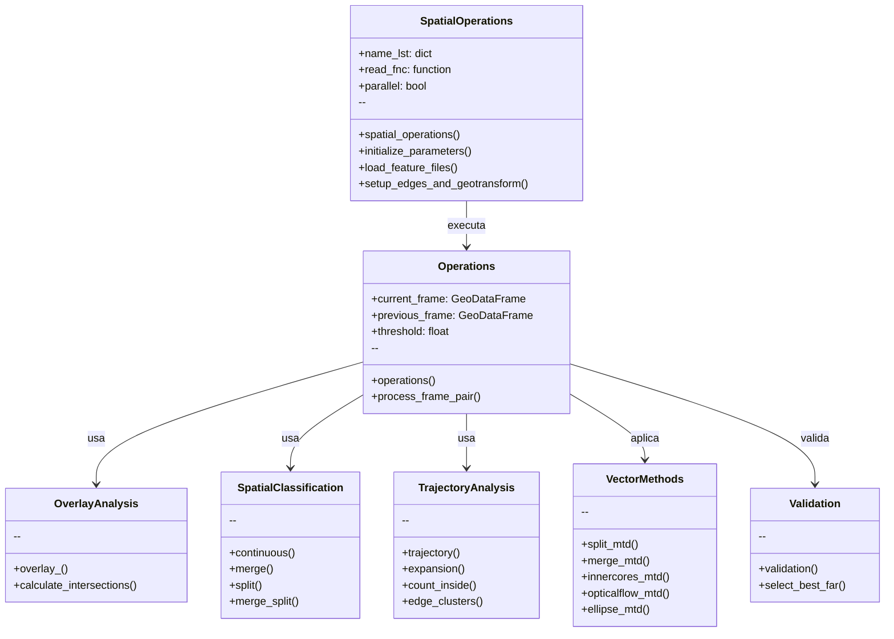

```mermaid
---
config:
  theme: mc
  look: classic
---
classDiagram
    class SpatialOperations {
        +name_lst: dict
        +read_fnc: function
        +parallel: bool
        --
        +spatial_operations()
        +initialize_parameters()
        +load_feature_files()
        +setup_edges_and_geotransform()
    }

    class Operations {
        +current_frame: GeoDataFrame
        +previous_frame: GeoDataFrame
        +threshold: float
        --
        +operations()
        +process_frame_pair()
    }

    class OverlayAnalysis {
        --
        +overlay_()
        +calculate_intersections()
    }

    class SpatialClassification {
        --
        +continuous()
        +merge()
        +split()
        +merge_split()
    }

    class TrajectoryAnalysis {
        --
        +trajectory()
        +expansion()
        +count_inside()
        +edge_clusters()
    }

    class VectorMethods {
        --
        +split_mtd()
        +merge_mtd()
        +innercores_mtd()
        +opticalflow_mtd()
        +ellipse_mtd()
    }

    class Validation {
        --
        +validation()
        +select_best_far()
    }

    SpatialOperations --> Operations : executa
    Operations --> OverlayAnalysis : usa
    Operations --> SpatialClassification : usa
    Operations --> TrajectoryAnalysis : usa
    Operations --> VectorMethods : aplica
    Operations --> Validation : valida
```